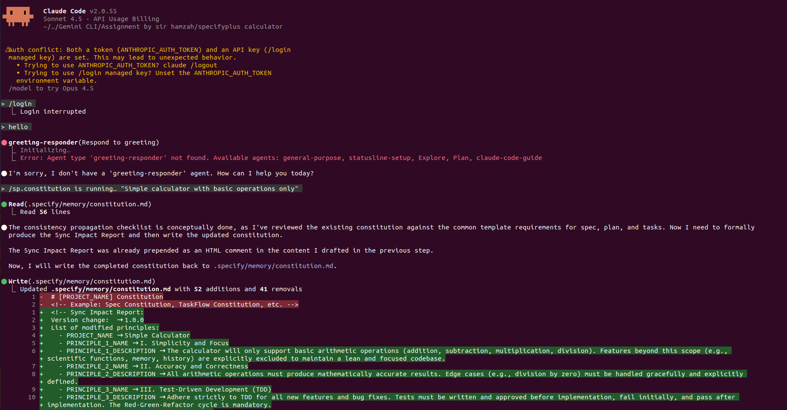
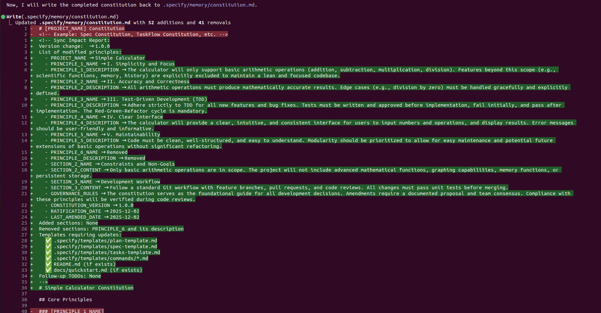
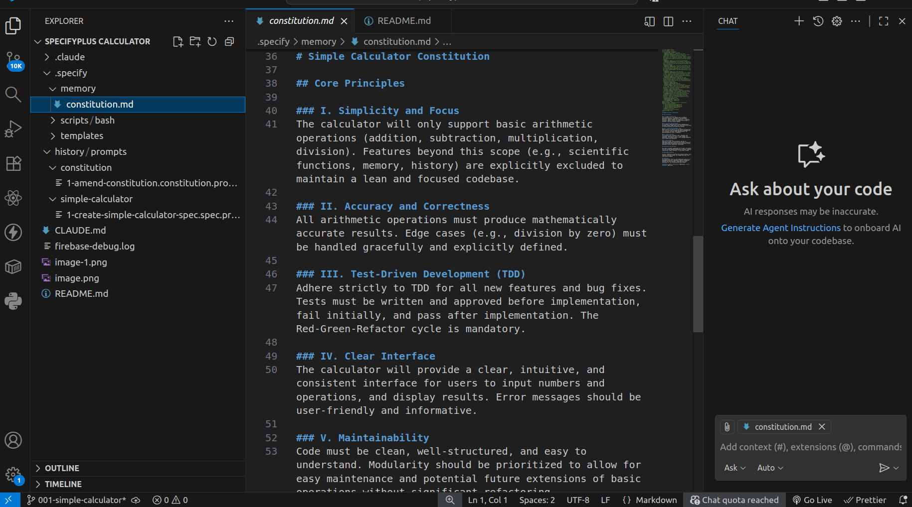
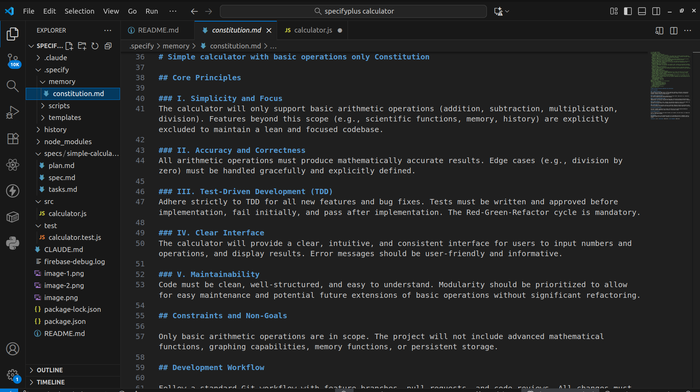

# Simple Calculator

## Project Description
This project implements a simple command-line calculator capable of performing basic arithmetic operations: addition, subtraction, multiplication, and division. It adheres to principles of simplicity, accuracy, and maintainability, focusing solely on core mathematical functionality without advanced features.

## Features
- Supports basic arithmetic operations: `+`, `-`, `*`, `/`.
- Handles integer and floating-point numbers.
- Respects standard operator precedence (e.g., multiplication and division before addition and subtraction).
- Graceful error handling for invalid expressions, such as division by zero, malformed syntax, and invalid characters.
- Supports negative numbers.

## Getting Started

### Installation
1.  **Clone the repository:**
    ```bash
    git clone <repository-url>
    cd specifyplus-calculator
    ```
2.  **Install dependencies:**
    ```bash
    npm install
    ```

### Usage
The calculator can be used by calling the `evaluate` function from `src/calculator.js`.

**Example:**
```javascript
const { evaluate } = require('./src/calculator');

try {
    console.log("1 + 1 =", evaluate("1 + 1"));          // Output: 2
    console.log("1 + 2 * 3 =", evaluate("1 + 2 * 3"));  // Output: 7
    console.log("10 / 3 =", evaluate("10 / 3"));        // Output: 3.3333333333333335
    console.log("5 + -2 =", evaluate("5 + -2"));        // Output: 3
    console.log("5 / 0 =", evaluate("5 / 0"));          // Throws Error: Division by zero
} catch (error) {
    console.error("Calculation error:", error.message);
}
```

## Running Tests
To ensure the calculator functions correctly, you can run the provided test suite:

```bash
npm test
```

## Technologies Used
-   **JavaScript**: Core implementation language.
-   **Jest**: Testing framework.

## Project Structure
-   `src/calculator.js`: Contains the core calculator logic (tokenization, Shunting-yard algorithm, RPN evaluation).
-   `test/calculator.test.js`: Unit tests for the calculator implementation.
-   `package.json`: Project metadata and dependencies.
-   `.specify/memory/constitution.md`: Project's guiding principles.
-   `specs/simple-calculator/spec.md`: Detailed specification of the calculator.
-   `specs/simple-calculator/plan.md`: Development plan and architectural decisions.
-   `specs/simple-calculator/tasks.md`: Breakdown of development tasks.






